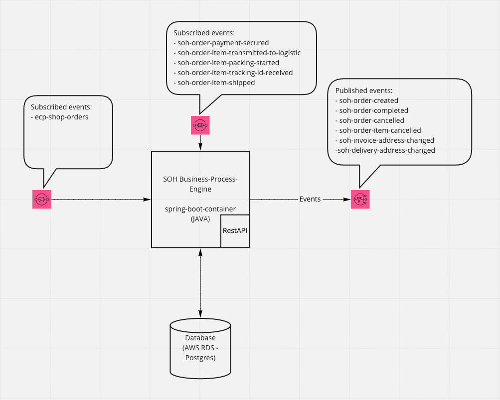

## Sales-Order-Hub

[](https://www.codacy.com?utm_source=github.com&amp;utm_medium=referral&amp;utm_content=kfzteile24/soh-business-processing-engine&amp;utm_campaign=Badge_Grade)

### Consumed & Published Events 

A list of Events that this projects publishes or consumes are [here](https://kfzteile24.atlassian.net/wiki/x/NgB9Y).

### Camunda & BPMN

The Sales order Hub uses Camunda to run the BPMN processes.

The processes are located in src/main/resources/processes

## Github Package Repo configuration
To reach out the maven github for kfzteile24 you must add  
the following part to the **profiles** sections in .m2/settings.xml file in your home folder:
```
<profile>
   <id>github</id>
   <repositories>
       <repository>
           <id>github</id>
           <name>GitHub kfzteile24 Apache Maven Packages</name>
           <url>https://maven.pkg.github.com/kfzteile24/json-schema-java-bundle</url>
       </repository>
   </repositories>
</profile>
```

Further you must add this part under **settings** tag directly:
```
<activeProfiles>
  <activeProfile>github</activeProfile>
</activeProfiles>
```

Finally you have to provide your [github credentials](https://github.com/settings/tokens):  
```
<servers>
	<server>
            <id>github</id>
            <username>your-username</username>
            <password>your-password</password>
          </server>
</servers>
```

## Start the project

### Database

1. Create a database and edit the following files:
    * make a copy of .env.localhost.dist to .env.localhost 
      replace FLYWAY and db variables with your settings
    
2. run source .env.localhost
3. run ./migrate.sh -> check output. Flyway should now go through all the files needed to setup the database

### Localstack for local AWS using/testing
Start localstack as described in the [README.md](./aws_localstack/README.md) in the aws_localstack directory.

### Application

Make a copy of application-local.yml.dist to application-local.yml and replace the dummy values starting with "your-"
with your configuration values.

The AWS ```cloud.aws.credentials``` can have any values for localstack and therefore don't have to be changed.

To install the app, run ```mvn clean package```. This installs all needed dependencies.

Then run the application with ```mvn spring-boot:run``` 

Login to the App:

http://localhost:8080 with
 
User: demo

Password: demo

### Run from IDE
To run this service, or the tests locally from Idea select ```Edit Configurations...``` and add
this environment variable:
SPRING_PROFILES_ACTIVE=local

### Repo for prepare sns topics in aws with terraform

[SNS-Topics](https://github.com/kfzteile24/soh-sns-topics)

## Documentation

### Architecture



Link to [miro board](https://miro.com/app/board/o9J_lRPP23M=/) 

[Confluence](https://kfzteile24.atlassian.net/wiki/spaces/IT/pages/574554350/Sales+Order+Hub)

## Swagger RestApi Documentation
```
http(s)://<host>:<port>/swagger-ui.html
```